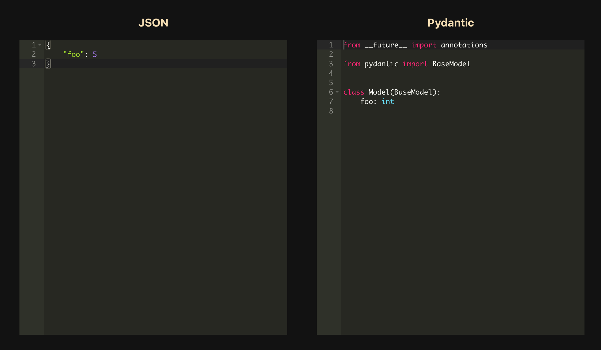

<!-- ABOUT THE PROJECT -->

## About The Project

[JSON to Pydantic](https://jsontopydantic.com) is a tool that lets you convert JSON objects into
Pydantic models. [JSON](https://www.json.org/json-en.html)
is the de-facto data interchange format of the internet, and
[Pydantic](https://pydantic-docs.helpmanual.io/)
is a library that makes parsing JSON in Python a breeze.

This project provides a web interface through which you can quickly
generate pydantic models from JSON objects.



### Built With

- [FastAPI](https://github.com/tiangolo/fastapi)
- [Create React App](https://github.com/facebook/create-react-app)
- [datamodel-code-generator](https://github.com/koxudaxi/datamodel-code-generator)

This project is hosted serverlessly on AWS.
The backend is deployed using AWS Lambda and API Gateway
and the frontend is deployed using S3 and Cloudfront.

<!-- GETTING STARTED -->

## Getting Started

To get a local copy up and running follow these simple steps.

### Prerequisites

- npm
- python 3.7+

### Install Dependencies

Clone the repo

```sh
git clone https://github.com/brokenloop/jsontopydantic.git
```

Install NPM Packages

```sh
cd client
npm install
```

Install Python Dependencies

```sh
cd server
python3 -m venv env
source env/bin/activate
pip install -r requirements.txt
```

### Run The Project

Client

```sh
cd client
npm start
```

If you want to test this using your local server, make sure you update the API link in `App.tsx`.

Server

```sh
cd server
uvicorn app.main:app --reload
```

<!-- CONTRIBUTING -->

## Contributing

Contributions are what make the open source community such an amazing place to be learn, inspire, and create. Any contributions you make are **greatly appreciated**.

1. Fork the Project
2. Create your Feature Branch (`git checkout -b feature/AmazingFeature`)
3. Commit your Changes (`git commit -m 'Add some AmazingFeature'`)
4. Push to the Branch (`git push origin feature/AmazingFeature`)
5. Open a Pull Request

<!-- ACKNOWLEDGEMENTS -->

## Acknowledgements

- [datamodel-code-generator](https://github.com/koxudaxi/datamodel-code-generator)

## License

jsontopydantic is released under the MIT License. http://www.opensource.org/licenses/mit-license
